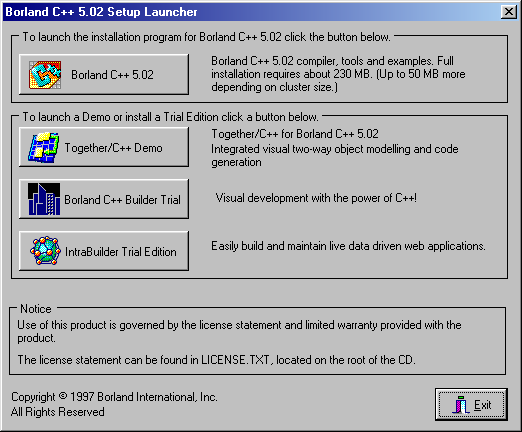
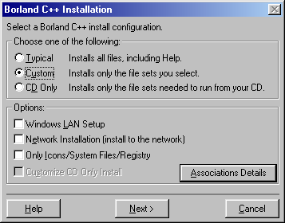
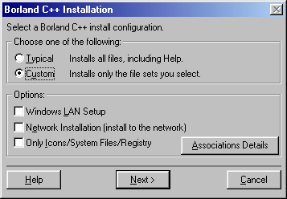
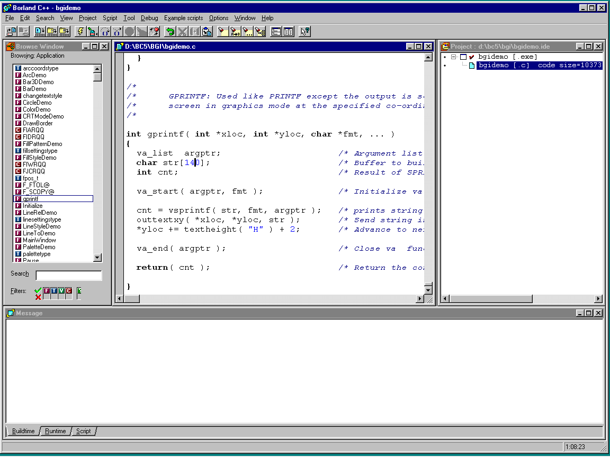
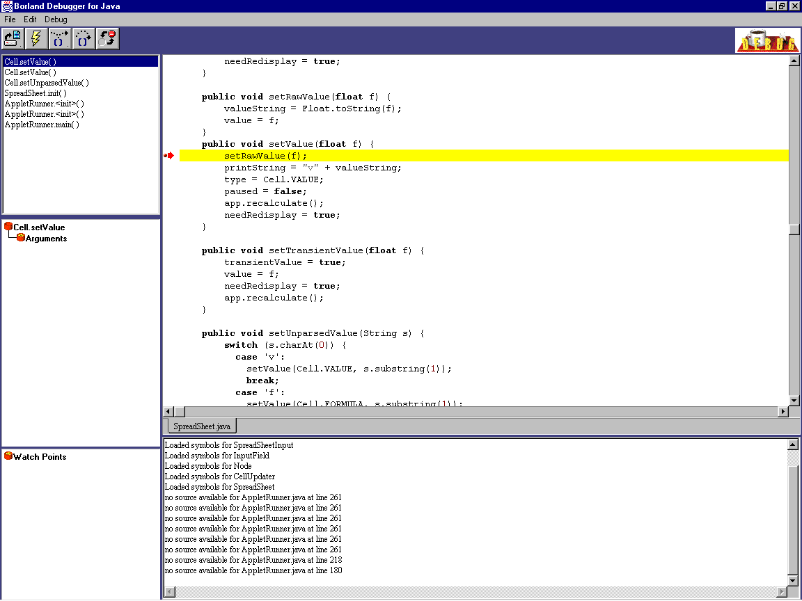

# Канувшие в Лету: обзор некоторых сред разработки

## Продукты компании Borland

### Borland C++ 5

Последняя версия продукта &mdash; 5.02, и выпущена она в 1997 году. Это последний из продуктов Borland,
позволяющий собирать и отлаживать код для DOS.

В сети [циркулирует](https://winworldpc.com/product/borland-c/5x) несколько разных инсталляторов продукта,
но на поверку результат установки оказывается один и тот же. На компакт-дисках распространялась совместная
поставка Borland C++ и только вышедшей первой версии [C++ Builder](https://ru.wikipedia.org/wiki/C++_Builder):



Два других варианта инсталляторов включают _только_ Borland C++ и различаются между собой незначительно:





Редактор кода на C и C++. Здесь нет ни автодополнения кода (того, что мы теперь называем "intellisense"),
ни поддержки нумерации строк, но зато есть подсветка синтаксиса:



В Borland C++ можно установить расширение, позволяющее работать с кодом на Java ("Borland C Add-on for Java"
или просто BCAJ). В состав расширения входит и слегка модифицированная версия JDK 1.0. Технология на тот момент
была настолько молода, что привычная нам команда `java -version` выводит

```
TBD
```

Видимо, расширение создавалось наспех, т. к. в редакторе кода нет даже подсветки синтаксиса. Более того, нет
никакого намёка на поддержку организации классов в [иерархию пакетов](https://ru.wikipedia.org/wiki/Package_(Java)).
Видимо, предполагалось, что программа на языке Java &mdash; это один или, в крайнем случае, два класса, помещённые
в пакет верхнего уровня (пакет по умолчанию):


Отладчик для Java никак не интегрирован со средой и запускается как отдельная внешняя программа:


