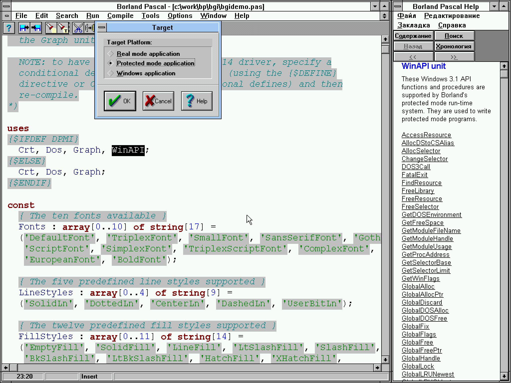
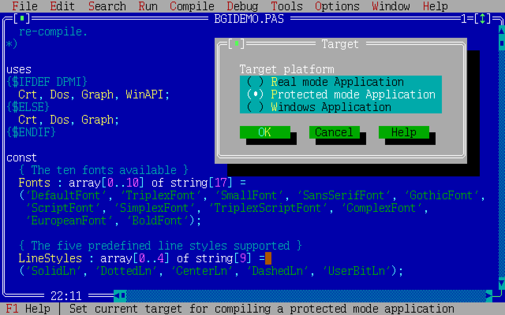

# Канувшие в Лету: обзор некоторых сред разработки

## Содержание

1. [Продукты компании Borland](#продукты-компании-borland)
    - [Borland Pascal](#borland-pascal)
    - [Borland C++ 3](#borland-c-3)
    - [Borland C++ 4](#borland-c-4)
    - [Borland C++ 5](#borland-c-5)


## Продукты компании Borland

### Borland Pascal

Последняя версия, 7.0, выпущенная в 1992 году, имеет консольную среду (`bp.exe`) для DOS и её GUI-вариант (`bpw.exe`)
для 16-разрядных версий Windows (Windows 3.x). С точки зрения функциональности обе среды абсолютно идентичны
и умеют генерировать код как для DOS, так и для Windows. Что касается сборки кода для DOS, у нас есть выбор
между созданием обычных DOS-программ реального времени ("Real mode Application") и программ,
работающих в так называемом защищённом режиме ("Protected mode Application"). Вот так, например, выглядит
выбор типа сборки в Windows-версии среды:



Вот так -- ровно тот же самый выбор в DOS-версии:



Сборка программы, работающей в защищённом режиме, достигается внедрением в конечный `exe`-файл кода
[DPMI-сервера](https://ru.wikipedia.org/wiki/DPMI)
(также известного как [DOS-расширитель](https://ru.wikipedia.org/wiki/%D0%A0%D0%B0%D1%81%D1%88%D0%B8%D1%80%D0%B8%D1%82%D0%B5%D0%BB%D1%8C_DOS))
`rtm.exe`, который входит в поставку среды разработки.

### Borland C++ 3
### Borland C++ 4
### Borland C++ 5

Последняя версия продукта &mdash; 5.02, и выпущена она в 1997 году. Это последний из продуктов Borland,
позволяющий собирать и отлаживать код для DOS.

В сети [циркулирует](https://winworldpc.com/product/borland-c/5x) несколько разных инсталляторов продукта,
но на поверку результат установки оказывается один и тот же. На компакт-дисках распространялась совместная
поставка Borland C++ и только вышедшей первой версии [C++ Builder](https://ru.wikipedia.org/wiki/C++_Builder):


Два других варианта инсталляторов включают _только_ Borland C++ и различаются между собой незначительно:


Редактор кода на C и C++. Здесь нет ни автодополнения кода (того, что мы теперь называем "intellisense"),
ни поддержки нумерации строк, но зато есть подсветка синтаксиса:


В Borland C++ можно установить расширение, позволяющее работать с кодом на Java ("Borland C Add-on for Java"
или просто BCAJ). В состав расширения входит и слегка модифицированная версия JDK 1.0. Технология на тот момент
была настолько молода, что привычная нам команда `java -version` выводит

```
TBD
```

Видимо, расширение создавалось наспех, т. к. в редакторе кода нет даже подсветки синтаксиса. Более того, нет
никакого намёка на поддержку организации классов в [иерархию пакетов](https://ru.wikipedia.org/wiki/Package_(Java)).
Видимо, предполагалось, что программа на языке Java &mdash; это один или, в крайнем случае, два класса, помещённые
в пакет верхнего уровня (пакет по умолчанию):


Отладчик для Java никак не интегрирован со средой и запускается как отдельная внешняя программа:


