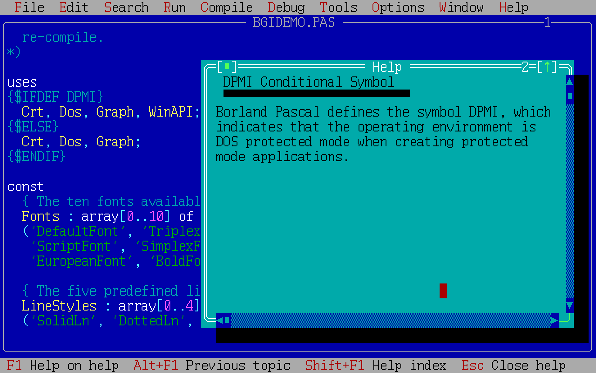
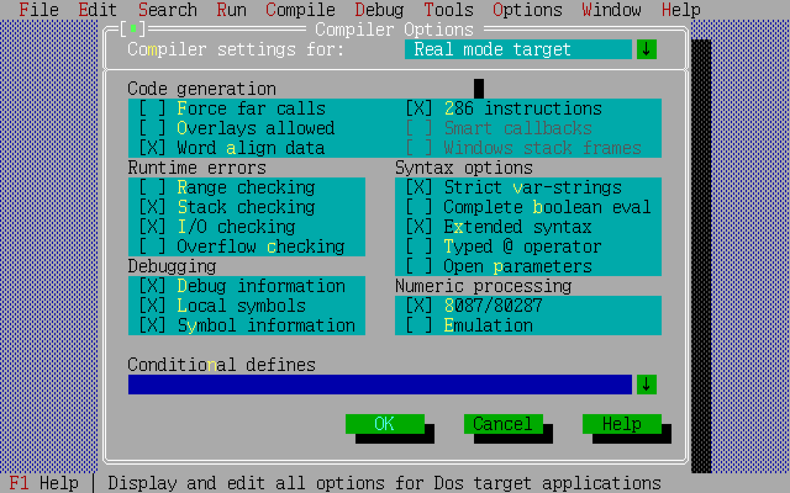
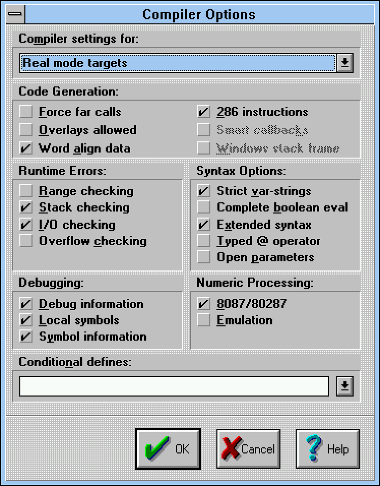
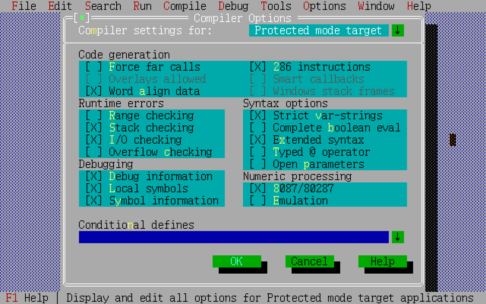
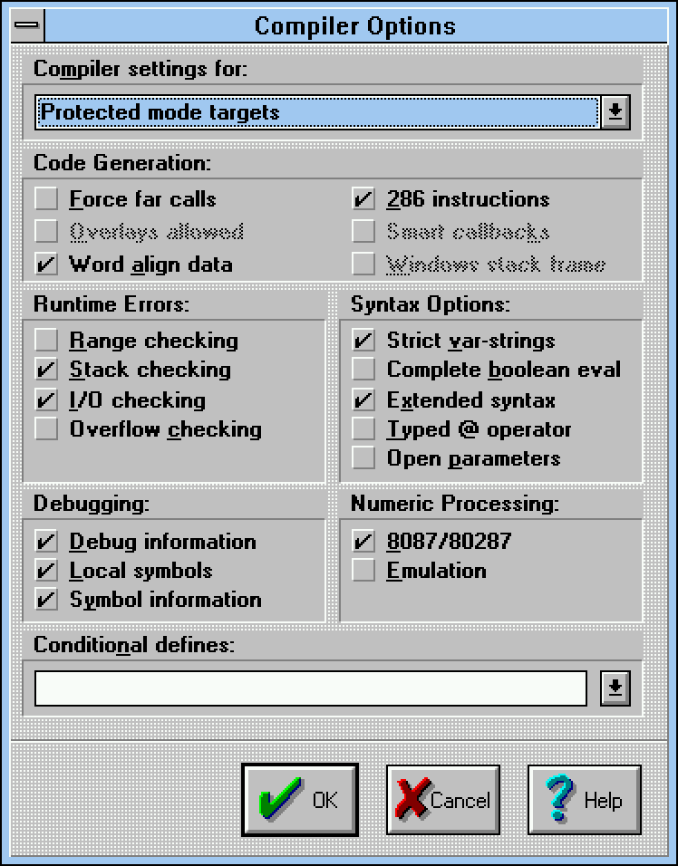
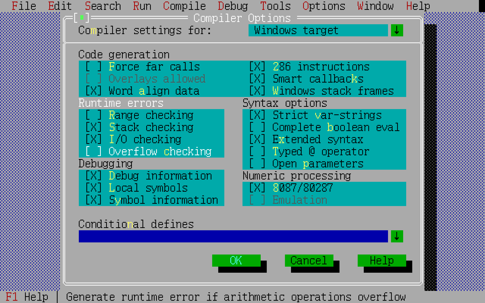
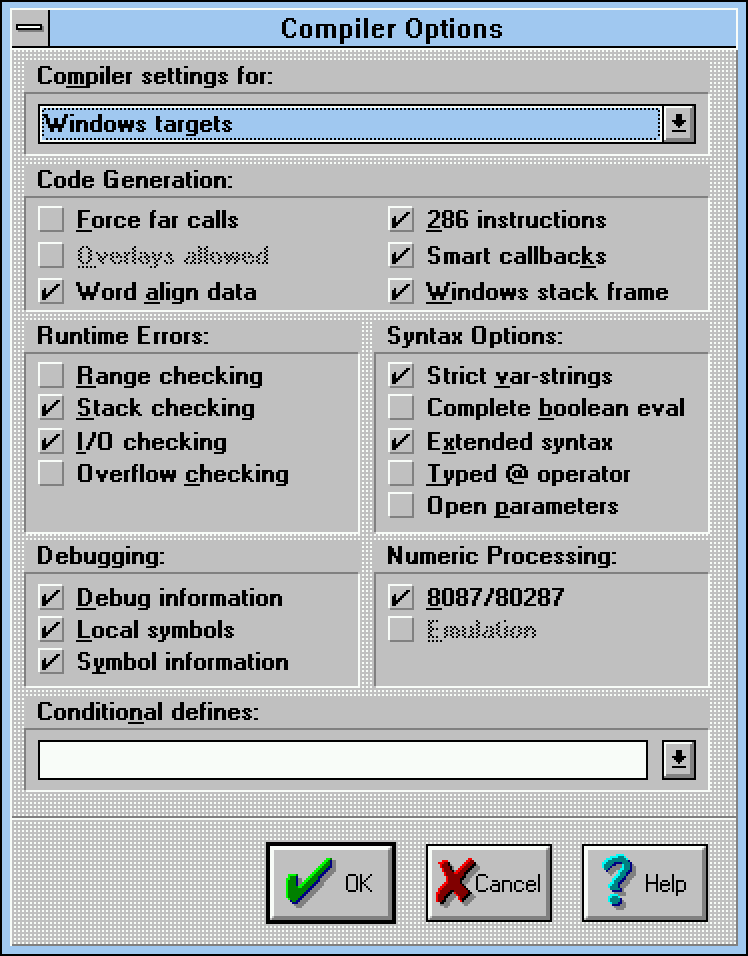
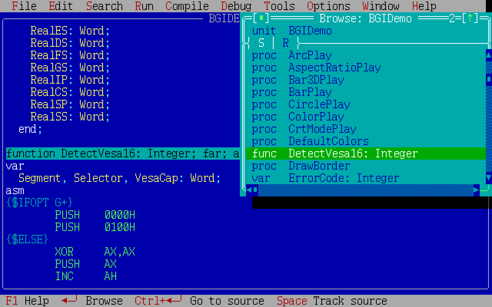

# Канувшие в Лету: обзор некоторых сред разработки из 90-х

## Содержание

1. [Продукты компании Borland](#продукты-компании-borland)
    - [Borland Pascal](#borland-pascal)
      * [Компилятор](#компилятор)
      * [Редактор кода](#редактор-кода)
    - [Borland C++ 3](#borland-c-3)
    - [Borland C++ 4](#borland-c-4)
    - [Borland C++ 5](#borland-c-5)


## Продукты компании Borland

### Borland Pascal

Последняя версия, 7.0, выпущенная в 1992 году, имеет консольную среду (`bp.exe`) для DOS и её GUI-вариант (`bpw.exe`)
для 16-разрядных версий Windows (Windows 3.x). С точки зрения функциональности обе среды абсолютно идентичны
и умеют генерировать код как для DOS, так и для Windows. Что касается сборки кода для DOS, у нас есть выбор
между созданием обычных DOS-программ реального времени ("Real mode Application") и программ,
работающих в так называемом защищённом режиме ("Protected mode Application"). Вот так, например, выглядит
выбор типа сборки в Windows-версии среды:


Вот так &mdash; ровно тот же самый выбор в DOS-версии:


Сборка программы, работающей в защищённом режиме, достигается внедрением в конечный `exe`-файл кода
[DPMI-сервера](https://ru.wikipedia.org/wiki/DPMI)
(также известного как [DOS-расширитель](https://ru.wikipedia.org/wiki/%D0%A0%D0%B0%D1%81%D1%88%D0%B8%D1%80%D0%B8%D1%82%D0%B5%D0%BB%D1%8C_DOS))
`rtm.exe`, который входит в поставку среды разработки. Конечная программа становится при этом примерно на 10 кБ больше.
Различить между собой разные типы DOS-программ на современной UNIX-системе можно с помощью стандартной утилиты `file`:

```
$ file *.exe
real.exe:     MS-DOS executable
protectd.exe: MS-DOS executable, NE for OS/2 1.x (EXE)
```

Формат **NE** &mdash; это [_New Executable_](https://ru.wikipedia.org/wiki/New_Executable), стандартизированный в 1985 году,
когда Microsoft и IBM ещё не разругались и совместно разрабатывали OS/2
(а потом, вскоре, совершенно внезапно для IBM, вышла первая версия Windows &mdash; но это другая история).

> Стоит сказать, впрочем, что `rtm.exe` &mdash; расширитель сугубо 16-разрядный
> (в далёком 1992-м о большем никто и не мечтал),
> и в присутствии другого сугубо 32-разрядного DPMI-сервера (такого, как `cwsdpmi.exe`, который требуется для работы редактора [`vim`](https://www.vim.org))
> программа, в которую он внедрён, работать не будет:
> 
> ```
> 16-bit DPMI unsupported.
> Loader error (0001): out of memory
> ```
> Впрочем, виртуальная DOS-среда в Windows 98 (окно `command.com`) предоставляет и 32-х, и 16-разрядные службы DPMI.

В примере кода на снимке конструкция вида

```pascal
uses
{$IFDEF DPMI}
  Crt, DOS, Graph, WinAPI;
{$ELSE}
  Crt, DOS, Graph;
{$ENDIF}
```

&mdash; это аналог директив препроцессора, направленных на условную компиляцию, в языках C и C++ (`#ifdef ... #else ... #endif`).
Символ `DPMI` автоматически устанавливается в непустое значение при выборе _Protected mode Application_:



Поскольку DOS-приложение, использующее DPMI-сервер, имеет возможность использовать часть системных вызовов Windows,
в примере кода выше мы дополнительно подключаем стандартный модуль `WinAPI`.

#### Компилятор

Компилятор может генерировать лишь 16-разрядный код, используя инструкции [80286](https://ru.wikipedia.org/wiki/Intel_80286) &mdash;
последнего 16-разрядного процессора Intel. Вот настройки компилятора для реального режима DOS:





Так выглядят настройки компилятора для генерации кода защищённого режима DOS. В отличие от реального режима, поддержки
[оверлеев](https://ru.wikipedia.org/wiki/Overlay_(%D0%BF%D1%80%D0%BE%D0%B3%D1%80%D0%B0%D0%BC%D0%BC%D0%B8%D1%80%D0%BE%D0%B2%D0%B0%D0%BD%D0%B8%D0%B5))
уже нет (видимо, потому, что в защищённом режиме уже неактуален пресловутый лимит в 640 кБ).





Наконец, настройки компилятора для Windows-кода:





#### Редактор кода

В редакторе кода, помимо подсветки синтаксиса, доступна навигация между модулями:


а также по членам модуля:

 - функциям,
 - процедурам, 
 - типам, 
 - переменным, 
 - константам.

Вот так, например, выглядит редактор непосредственно после перехода к функции `DetectVesa16`. В режиме **S**
доступна собственно навигация, в режиме **R** &mdash; обратные ссылки на функцию:



В Windows-версии среды элементы определённых типов можно выборочно включать или исключать из обзора. Вот что будет,
если мы оставим только функции (**F**) и процедуры (**P**):


### Borland C++ 3
### Borland C++ 4
### Borland C++ 5

Последняя версия продукта &mdash; 5.02, и выпущена она в 1997 году. Это последний из продуктов Borland,
позволяющий собирать и отлаживать код для DOS.

В сети [циркулирует](https://winworldpc.com/product/borland-c/5x) несколько разных инсталляторов продукта,
но на поверку результат установки оказывается один и тот же. На компакт-дисках распространялась совместная
поставка Borland C++ и только вышедшей первой версии [C++ Builder](https://ru.wikipedia.org/wiki/C++_Builder):


Два других варианта инсталляторов включают _только_ Borland C++ и различаются между собой незначительно:


Редактор кода на C и C++. Здесь нет ни автодополнения кода (того, что мы теперь называем "[IntelliSense](https://ru.wikipedia.org/wiki/IntelliSense)"),
ни поддержки нумерации строк, но зато есть уже знакомый нам по _Borland Pascal_ браузер кода,
за целых пять лет не претерпевший ни единого изменения, и подсветка синтаксиса:


В Borland C++ можно установить расширение, позволяющее работать с кодом на Java ("Borland C Add-on for Java"
или просто **BCAJ**). В состав расширения входит и слегка модифицированная версия JDK 1.0. Технология на тот момент
была настолько молода, что привычная нам команда `java -version` выводит

```
java version "internal_build"
```

Видимо, расширение создавалось наспех, т. к. в редакторе кода нет даже подсветки синтаксиса. Более того, нет
никакого намёка на поддержку организации классов в [иерархию пакетов](https://ru.wikipedia.org/wiki/Package_(Java)).
Видимо, предполагалось, что программа на языке Java &mdash; это один или, в крайнем случае, два класса, помещённые
в пакет верхнего уровня (пакет по умолчанию):


Отладчик для Java никак не интегрирован со средой и запускается как отдельная внешняя программа:


