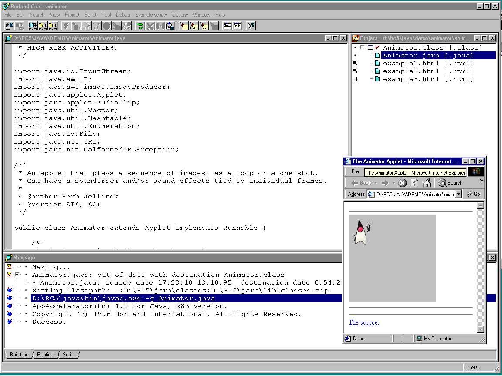

# Канувшие в Лету: обзор некоторых сред разработки

## Продукты компании Borland

### Borland C++ 5

Редактор кода на C и C++. 

Здесь нет ни автодополнения кода (того, что мы теперь называем "intellisense"), ни поддержки нумерации строк,
но зато есть подсветка синтаксиса:


В Borland C++ можно установить расширение, позволяющее работать с кодом на Java ("Borland C Add-on for Java"
или просто BCAJ). В состав расширения входит и слегка модифицированная версия JDK 1.0. Технология на тот момент
была настолько молода, что привычная нам команда `java -version` выводит

```
TBD
```

Видимо, расширение создавалось наспех, т. к. в редакторе кода нет даже подсветки синтаксиса:



Отладчик для Java никак не интегрирован со средой и запускается как отдельная внешняя программа:


